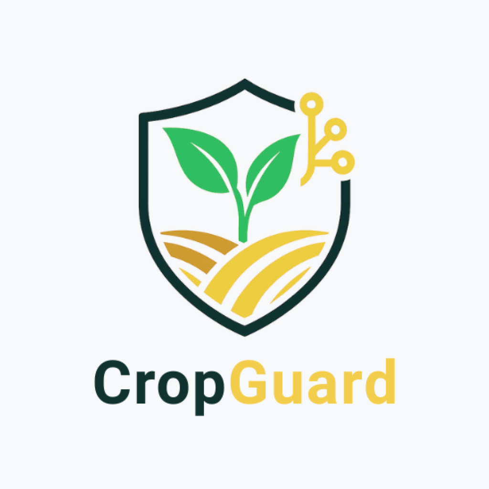
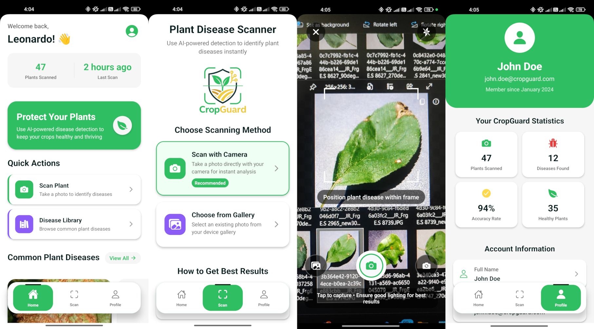

<!-- <p align="center">
   
</p> -->

# CropGuard 🌱

CropGuard is an AI-powered plant disease detection mobile application built with React Native and Expo. The app helps farmers and gardeners identify plant diseases through image analysis, providing early detection and treatment recommendations to protect crops and improve agricultural outcomes.


<p align="center">
  
</p>

## Features

🔍 **Plant Disease Scanning** - Capture or upload plant images for AI-powered disease detection  
📊 **User Statistics** - Track scanning history, accuracy rates, and disease detection records  
👤 **User Account Management** - Personalized profiles with scanning statistics and preferences  
🎯 **Disease Information** - Detailed information about detected diseases and treatment options  
📱 **Cross-Platform** - Available on both iOS and Android devices  

## Technology Stack

- **Frontend**: React Native with Expo
- **Navigation**: Expo Router (file-based routing)
- **UI Components**: React Native, Ionicons
- **Language**: TypeScript
- **Styling**: StyleSheet with responsive design
- **AI Integration**: Plant disease detection model (HuggingFace integration)

## Getting Started

### Prerequisites

- Node.js (v16 or higher)
- npm or yarn
- Expo CLI
- iOS Simulator (for macOS) or Android Emulator

### Installation

1. **Clone the repository**
   ```bash
   git clone https://github.com/Jaysum57/CropGuard.git
   cd CropGuard
   ```

2. **Install dependencies**
   ```bash
   npm install
   ```

3. **Start the development server**
   ```bash
   npx expo start
   ```

4. **Run on device/emulator**
   - For iOS: Press `i` to open in iOS Simulator
   - For Android: Press `a` to open in Android Emulator
   - For physical device: Scan QR code with Expo Go app

## Project Structure

```
CropGuard/
├── app/                    # Main application screens
│   ├── _layout.tsx        # Root layout component
│   ├── index.tsx          # Home/landing screen
│   ├── scan.tsx           # Plant scanning interface
│   ├── account.tsx        # User profile and settings
│   └── details/           # Disease detail screens
│       ├── disease.tsx    # General disease information
│       └── rust.tsx       # Rust disease specifics
├── assets/                # Static assets
│   ├── fonts/            # Custom fonts and images
│   └── images/           # App icons and splash screens
├── app-example/          # Example/template code
└── README.md
```

## Key Features Overview

### Home Screen (`index.tsx`)
- Welcome interface with app branding
- Quick access to scanning functionality
- Clean, modern UI with hero section

### Scanning Interface (`scan.tsx`)
- Camera integration for plant image capture
- AI-powered disease detection processing
- Results display and analysis

### User Account (`account.tsx`)
- Personal statistics and scanning history
- Account information management
- Settings and preferences

### Disease Details (`details/`)
- Comprehensive disease information
- Treatment recommendations
- Educational content about plant health

## Development

### Available Scripts

```bash
# Start development server
npm start

# Start with specific platform
npx expo start --ios
npx expo start --android

# Build for production
npx expo build

# Reset project (removes example code)
npm run reset-project
```

### Code Style

- TypeScript for type safety
- Consistent component structure
- Responsive design principles
- Clean, documented code

## Contributing

1. Fork the repository
2. Create your feature branch (`git checkout -b feature/amazing-feature`)
3. Commit your changes (`git commit -m 'Add some amazing feature'`)
4. Push to the branch (`git push origin feature/amazing-feature`)
5. Open a Pull Request

## AI Model Integration

CropGuard integrates with a plant disease detection model for accurate diagnosis. The AI component is housed in a separate HuggingFace implementation that provides:

- Real-time image analysis
- Disease classification
- Confidence scoring
- Treatment recommendations

## License

This project is licensed under the MIT License - see the [LICENSE](LICENSE) file for details.

## Contact

**Project Maintainer**: Jaysum57  
**Repository**: [https://github.com/Jaysum57/CropGuard](https://github.com/Jaysum57/CropGuard)

## Acknowledgments

- Expo team for the excellent React Native framework
- HuggingFace for AI model infrastructure
- Open source community for various dependencies

---

**Built with ❤️ for sustainable agriculture and crop protection**
